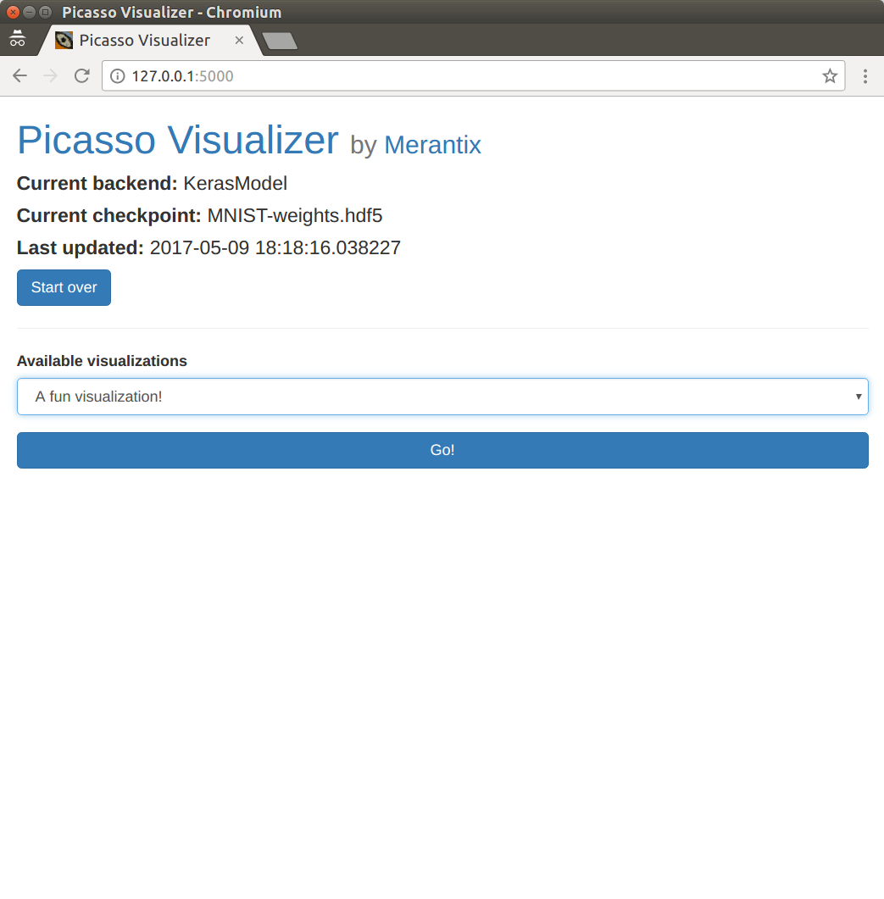
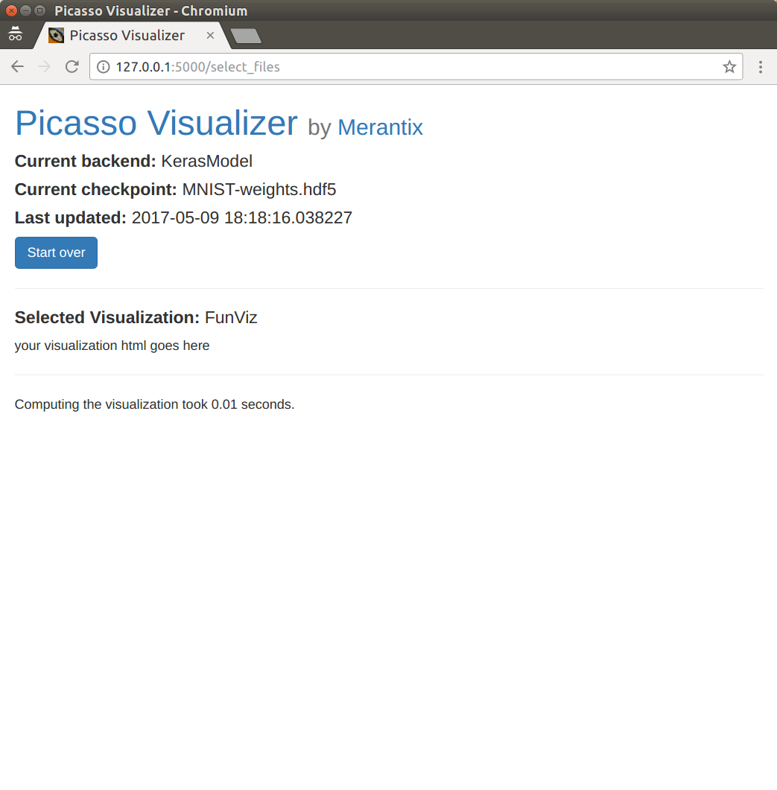
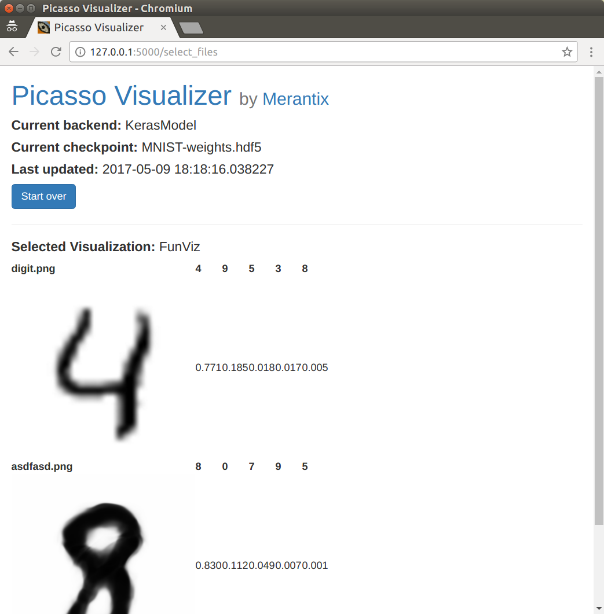
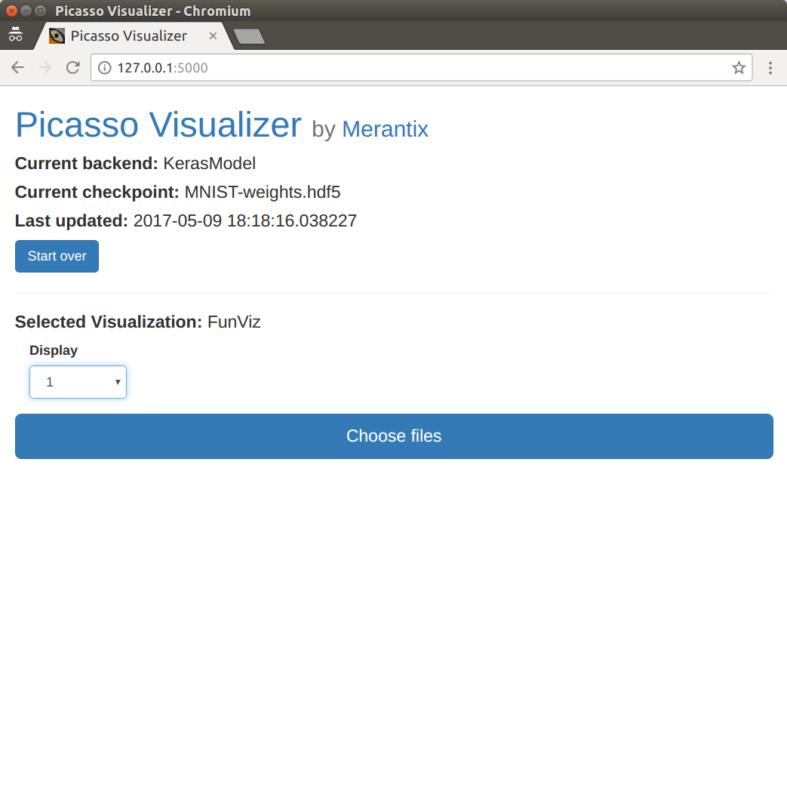
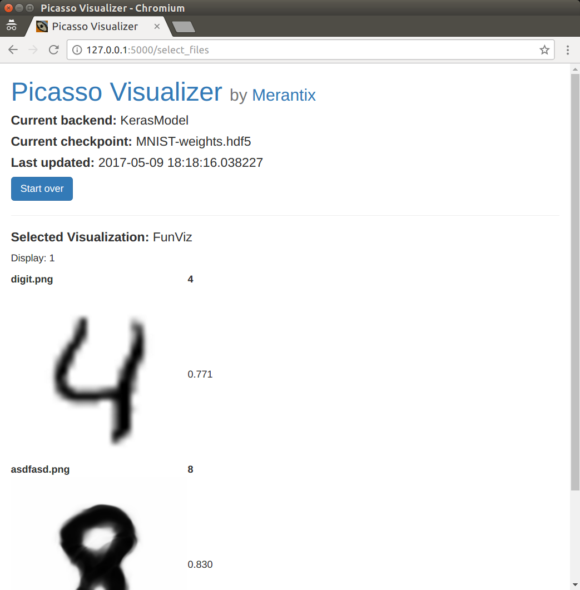

===============================
Making your own visualizations
===============================

Picasso is made with ease of adding new models in mind.  This tutorial will show you how to make a new visualization from scratch.  Our visualization will be based on the very simple :class:`~picasso.visualizations.class_probabilities.ClassProbabilities` (see `ClassProbabilities`_ code) visualization, along with its HTML `template`_.

Setup
=====

Every visualization requires a class defining its behavior and an HTML template defining its layout.  You can put them in the ``visualizations`` and ``templates`` folder respectively.  It's important that the class name and HTML template name are the same.

For our example, ``FunViz``, we'll need ``picasso/visualizations/fun_viz.py``:

.. code-block:: python3

   from picasso.visualizations import BaseVisualization

   class FunViz(BaseVisualization):

       def __init__(self, model):
           self.description = 'A fun visualization!'
           self.model = model

       def make_visualization(self, inputs, output_dir, settings=None):
           pass

and ``picasso/templates/FunViz.html``:

.. code-block:: jinja

   
   
   your visualization html goes here
   

Some explanation for the ``FunViz`` class in ``fun_viz.py``: All visualizations should inherit from :class:`~picasso.visualizations.__init__.BaseVisualization` (see `code <BaseVisualization>`_).  You must implement the ``__init__`` method, and it should accept one argument, ``model``. ``model`` will be an instance of a child class of `Model`_, which provides an interface to the machine learning backend.  You can also add a description which will display on the landing page.

Some explanation for ``FunViz.html``: The web app is uses `Flask`_, which uses `Jinja2`_ templating.  This explains the funny ```` delimiters.   The ```` just tells the your page to inherit from a boilerplate.  All your html should sit within the ``vis`` block.

You can even start the app at this point (see :doc:`Quickstart </readme>`).  You should see your visualization in the menu.

   Are we having fun yet? ☆(◒‿◒)☆ YES

If you try to upload images, you will get an error.  This is because the visualization doesn't actually return anything to visualize.  Let's fix that.

Add visualization logic
=======================
   
Our visualization should actually do something.  It's just going to compute the class probabilities and pass them back along to the web app. So we'll add:

.. code-block:: python3
   :emphasize-lines: 11-21

   from picasso.visualizations import BaseVisualization

   class FunViz(BaseVisualization):

       def __init__(self, model):
           self.description = 'A fun visualization!'
           self.model = model

       def make_visualization(self, inputs, output_dir, settings=None):
           pre_processed_arrays = self.model.preprocess([example['data']
                                                        for example in inputs])
           predictions = self.model.sess.run(self.model.tf_predict_var,
                                             feed_dict={self.model.tf_input_var:
                                                        pre_processed_arrays})
           filtered_predictions = self.model.decode_prob(predictions)
           results = []
           for i, inp in enumerate(inputs):
               results.append({'input_file_name': inp['filename'],
                               'predict_probs': filtered_predictions[i]})
           return results

Let's go line by line:

.. code-block:: python3
   :emphasize-lines: 7,8 

   ...

   class FunViz(BaseVisualization):
       ...

       def make_visualization(self, inputs, output_dir, settings=None):
           pre_processed_arrays = self.model.preprocess([example['data']
                                                        for example in inputs])
           ...

``inputs`` are sent to the visualization class as a list of ``{'filename': ... , 'data': ...}`` dictionaries.  The data are `PIL Images`_ created from raw data that the user has uploaded to the webapp.  The ``preprocess`` method of ``model`` simply turns the input images into appropriately-sized arrays for the input of whichever computational graph you are using.  Therefore, ``pre_processed_arrays`` is an array with the first dimension equal to the number of inputs, and subsequent dimensions determined by the ``preprocess`` function.

.. code-block:: python3
   :emphasize-lines: 9-11 

   ...

   class FunViz(BaseVisualization):
       ...

       def make_visualization(self, inputs, output_dir, settings=None):
           pre_processed_arrays = self.model.preprocess([example['data']
                                                        for example in inputs])
           predictions = self.model.sess.run(self.model.tf_predict_var,
                                             feed_dict={self.model.tf_input_var:
                                                        pre_processed_arrays})
           ...

Here's where we actually do some computation to be used in the visualization. Note that the ``model`` object exposes the Tensorflow session (regardless of if the backend is Keras or Tensorflow).  We also store the input and output tensors with the ``model`` members ``tf_input_var`` and ``tf_predict_var`` respectively.  Thus this is just a standard Tensorflow run which will return an array of dimension ``n x c`` where ``n`` is the number of inputs, and ``c`` is the number of classes. 

.. code-block:: python3
   :emphasize-lines: 12

   ...

   class FunViz(BaseVisualization):
       ...

       def make_visualization(self, inputs, output_dir, settings=None):
           pre_processed_arrays = self.model.preprocess([example['data']
                                                        for example in inputs])
           predictions = self.model.sess.run(self.model.tf_predict_var,
                                             feed_dict={self.model.tf_input_var:
                                                        pre_processed_arrays})
           filtered_predictions = self.model.decode_prob(predictions)
           ...

``decode_prob`` is another model-specific method.  It gives us back the class labels from the ``predictions`` array.  The format will be list of dictionaries in the format ``[{'index': class_index, 'name': class_name, 'prob': class_probability}, ...]``.  It will also only return the top class predictions (this comes in handy when using models like VGG16, which has 1000 classes).

.. code-block:: python3
   :emphasize-lines: 13-17

   ...

   class FunViz(BaseVisualization):
       ...

       def make_visualization(self, inputs, output_dir, settings=None):
           pre_processed_arrays = self.model.preprocess([example['data']
                                                        for example in inputs])
           predictions = self.model.sess.run(self.model.tf_predict_var,
                                             feed_dict={self.model.tf_input_var:
                                                        pre_processed_arrays})
           filtered_predictions = self.model.decode_prob(predictions)
           results = []
           for i, inp in enumerate(inputs):
               results.append({'input_file_name': inp['filename'],
                               'predict_probs': filtered_predictions[i]})
           return results

Here we arrange the results to pass back to the webapp.    In our case, we just return a list of dictionaries which hold the original filename, and the formatted prediction results. The exact structure isn't so important, but you'll have to deal with it when you write your HTML template, so try to keep it manageable. Now you'll be able to see your result page from earlier.

   At least it's fast, right? 

Of course, we haven't told the template how to display the results yet.  Let's get down to it.

Configure the HTML template
===========================

We need to specify how to layout our visualization.  Here are the lines we'll add:

.. code-block:: jinja
   :emphasize-lines: 3-20

   
   
   <table>
   
       <tr>
         <td><b> {{ result.filename }} </b></td>
         
           <td><b> {{ predict_prob.name }} </b></td>
         
       </tr>
       <tr>
         <td>
           
         </td>
         
           <td> {{ predict_prob.prob }} </td>
         
       </tr>
   
   </table>
   

Let's look at the pieces separately again:

.. code-block:: jinja
   :emphasize-lines: 3,4,19,20

   
   
   <table>
   
       <tr>
         <td><b> {{ result.filename }} </b></td>
         
           <td><b> {{ predict_prob.name }} </b></td>
         
       </tr>
       <tr>
         <td>
           
         </td>
         
           <td> {{ predict_prob.prob }} </td>
         
       </tr>
   
   </table>
   

Every visualization gets a ``results`` object from the web app.  The ``results`` object will have the exact same structure as the return value of the ``make_visualization`` method of your visualization class.  Since we returned a list, we iterate over it with this for-loop to generate the rows of the table.

.. code-block:: jinja
   :emphasize-lines: 5,10,11,18

   
   
   <table>
   
       <tr>
         <td><b> {{ result.filename }} </b></td>
         
           <td><b> {{ predict_prob.name }} </b></td>
         
       </tr>
       <tr>
         <td>
           
         </td>
         
           <td> {{ predict_prob.prob }} </td>
         
       </tr>
   
   </table>
   

There are actually two rows per result.  One with the filename and class labels, and one with the input image and class probabilities.  Let's look at each in turn.

.. code-block:: jinja
   :emphasize-lines: 6-9

   
   
   <table>
   
       <tr>
         <td><b> {{ result.filename }} </b></td>
         
           <td><b> {{ predict_prob.name }} </b></td>
         
       </tr>
       <tr>
         <td>
           
         </td>
         
           <td> {{ predict_prob.prob }} </td>
         
       </tr>
   
   </table>
   

The first column has the filename and the class name headers.  The for-loop loops over the ``result.predict_prob`` list of predictions (which we generated in ``make_visualization``) and puts each class header in a cell.

.. code-block:: jinja
   :emphasize-lines: 12-17

   
   
   <table>
   
       <tr>
         <td><b> {{ result.filename }} </b></td>
         
           <td><b> {{ predict_prob.name }} </b></td>
         
       </tr>
       <tr>
         <td>
           
         </td>
         
           <td> {{ predict_prob.prob }} </td>
         
       </tr>
   
   </table>
   

The second row contains the input image and the actual numerical probabilities.  Note the ``inputs/`` in the ``img`` tag.  All input images are stored here by the web app. 

   Sooo beautiful ⊂◉‿◉つ

Similarly, there is an ``outputs/`` folder (not shown in this example).  Its path is passed to the visualization class as ``output_dir``.  Anything the visualization stores there is also available to the template (for example, additional images needed for the visualization).

Add some settings
=================

Maybe we'd like the user to be able to limit the number of classes shown.  We can easily do this by adding a ``settings`` property to the ``FunViz`` class.

.. code-block:: python3
   :emphasize-lines: 5, 21

   from picasso.visualizations import BaseVisualization

   class FunViz(BaseVisualization):
       settings = {'Display': ['1', '2', '3']}

       def __init__(self, model):
           self.description = 'A fun visualization!'
           self.model = model

       def make_visualization(self, inputs, output_dir, settings=None):
           pre_processed_arrays = self.model.preprocess([example['data']
                                                        for example in inputs])
           predictions = self.model.sess.run(self.model.tf_predict_var,
                                             feed_dict={self.model.tf_input_var:
                                                        pre_processed_arrays})
           filtered_predictions = self.model.decode_prob(predictions)
           results = []
           for i, inp in enumerate(inputs):
               results.append({'input_file_name': inp['filename'],
                               'predict_probs': filtered_predictions[i][:int(settings['Display'])]})
           return results

A page to select the settings will automatically be generated.

   The automatically generated settings page
   

   It works! ヽ(^◇^*)/ 

Add some styling
================

The template that ``FunViz.html`` derives from imports `Bootstrap`_, so you can add some fancier styling if you like!

.. code-block:: jinja

   
   
   <table class="table table-sm table-striped">
   	<tbody>
   	
       <tr>
         <td align="center"><b> {{ result.filename }} </b></td>
         
           <td align="center"><b> {{ predict_prob.name }} </b></td>
         
       </tr>
       <tr>
         <td align="center">
           
         </td>
         
           <td class="vert-align" align="center"> {{ predict_prob.prob }} </td>
         
       </tr>
   	
   	</tbody>
   </table>
   

Further Reading
===============

For more complex visualizations, see the examples in `the visualizations module`_.

.. _ClassProbabilities: https://github.com/merantix/picasso/blob/master/picasso/visualizations/class_probabilities.py

.. _template: https://github.com/merantix/picasso/blob/master/picasso/templates/ClassProbabilities.html

.. _BaseVisualization: https://github.com/merantix/picasso/blob/master/picasso/visualizations/__init__.py 

.. _Model: https://github.com/merantix/picasso/blob/master/picasso/ml_frameworks/model.py

.. _Flask: http://flask.pocoo.org/

.. _Jinja2: http://jinja.pocoo.org/docs/

.. _PIL Images: http://pillow.readthedocs.io/en/latest/reference/Image.html

.. _Bootstrap: http://getbootstrap.com/

.. _the visualizations module: https://github.com/merantix/picasso/blob/master/picasso/visualizations/
